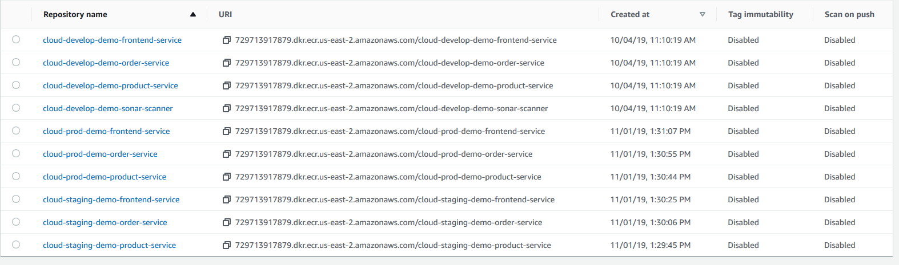

# DevOps CI/CD for Native cloud with Kubernetes and Gitlab CI/CD Demonstration

Build a demonstration e-commerce application with Docker image for Microservices using Kubernetes and Gitlab CI/CD

## Contents

- [DevOps CI/CD for Native cloud with Kubernetes and Gitlab CI/CD Demonstration](#devops-ci/cd-for-native-cloud-with-kubernetes-and-gitlab-ci/cd-demonstration)
  - [Contents](#contents)
  - [Introduction](#introduction)
    - [Purpose](#purpose)
    - [Audience](#audience)
    - [System Infrastructure Design](#system-infrastructure-design)
    - [CI/CD DevOps Design](#cicd-devops-design)
  - [Infrastructure Preparation (AWS)](#infrastructure-preparation)
    - [Policies Check-list for IAM user](#policies-checklist-for-iam-user)
    - [Create Access key](#create-access-key)
    - [Get CentOS 7 Image ID (AMI)](#get-centos-7-image-id)
    - [Create Key Pair](#create-key-pair)
    - [Run AWS CloudFormation for infrastructure setup](#run-aws-cloudformation-for-infrastructure-setup)
    - [Create ECR repository for keeping build image](#create-ecr-repository-for-keeping-build-image)
  - [Environment Preparation](#environment-preparation)
    - [Setup Git profile](#setup-git-profile)
    - [Install Docker on Gitlab runner instance (CentOS7)](#install-docker-on-gitlab-runner-instance)
    - [Setup Gitlab runner instanec](#setup-gitlab-runner-instance)
    - [Setup kubernetes cluster (CentOS 7)](#setup-kubernetes-cluster)
    - [Update kubeconfig file with cluster config](#setup-kubeconfig-file-with-cluster-config)
    - [Install haproxy](#install-haproxy)
    - [Install nginx ingress controller](#install-nginx-ingress-controller)
    - [Config the haproxy to load balancing the request to ingress controller](#config-the-haproxy-to-load-balancing-the-request-to-ingress-controller)
  - [Deployment Step](#deployment-step)
    - [Setup MySQL DB for all environments](#setup-mysql-db-for-all-environments)
    - [Run CI/CD gitlab pipeline](#run-cicd-gitlab-pipeline)
    - [Create ingress for services](#create-ingress-for-services)
    - [Deploy specific version](#deploy-specific-version)
  - [Smoke testing](#smoke-testing)
    - [The application](#the-application)
    - [The CICD pipeline](#the-cicd-pipeline)
  - [Clearance](#clearance)
    - [Delete CloudFormation Infrastructure stack (AWS)](#delete-cloudformation-infrastructure-stack)

## Introduction
### Purpose
This document describes the system resources and processes from the deployment perspective and provides comprehensive guidelines on operating and maintaining the system. The main topics covered in this document include:
  - Deployment preparations and checklists
  - Detailed guidelines for deployment

### Audience
This document mainly targets the operation team and whomever concerned with the operating perspectives of the system.

### System Infrastructure Design

### CICD DevOps Design

## Infrastructure Preparation
### Policies Checklist for IAM user
The IAM user for jenkins must has the following policies attached both directly or indirectly by group for deploying successfully.

### Create access key

- **Step 1**: Use your AWS account ID or account alias, your IAM user name, and your password to sign in to the IAM console.

- **Step 2**: In the navigation bar on the upper right, choose your user name, and then choose My Security Credentials.

- **Step 3**: On the AWS IAM Credentials tab, choose Create access key. Then choose Download .csv file to save the access key ID and secret access key to a .csv file on your computer. Store the file in a secure location. You will not have access to the secret access key again after this dialog box closes. After you have downloaded the .csv file, choose Close. When you create an access key, the key pair is active by default, and you can use the pair right away.

### Get CentOS 7 image ID
**Step 1**: On AWS CLI, run the following script command: “aws ec2 describe-images --owners 'aws-marketplace' --filters 'Name=product-code,Values=aw0evgkw8e5c1q413zgy5pjce' --query 'sort_by(Images, &CreationDate)[-1].[ImageId]' --output 'text' --region {AWS_REGION}”
**Step 2**: Save the result.

### Create Key Pair
Key Pair is used to ssh to the ec2 bastion and to create the ssh tunnel to manage backend DB.
- **Step 1:** Open the Amazon EC2 console at https://console.aws.amazon.com/ec2/.
- **Step 2:** In the navigation pane, under NETWORK & SECURITY, choose Key Pairs.
- **Step 3:** Choose Create Key Pair  

- **Step 4:** Enter a name for the new key pair in the Key pair name field of the Create Key Pair dialog box, and then choose Create.

**Note**
Take note this key pair name as it will be used as a parameter in the Cloud Formation **cloud-demo-infrastructure.json** template file.

### Run AWS CloudFormation for infrastructure setup
**Prerequisites**: CloudFormation template: k8s-template.json

- **Step 1**: Go to the AWS Cloud Formation console homepage.
- **Step 2**:Choose Create Stack.
- **Step 3**: Choose “Upload a template file” or Specify an Amazon S3 template URL, as appropriate. Select file k8s-template.json
 
- **Step 4**:	Choose Next.
- **Step 5**:	Give the stack a name (for example, cloud-dev-demo-k8s-infras), and then type the parameter value for BastionImageID, and KeyPairName before clicking on Next.
 
- **Step 6**:	Accept the defaults, and then choose Next
- **Step 7**:	Finally, review the stack information and then click Create stack button.

### Create ECR repository for keeping build image
- **Step 1**: Open the Amazon ECR console at https://console.aws.amazon.com/ecr/repositories.
- **Step 2**: From the navigation bar, choose the Region to create your repository in.
- **Step 3**: In the navigation pane, choose Repositories.
- **Step 4**: On the Repositories page, choose Create repository.
- **Step 5**: For Repository configuration, enter a unique name for your repository.
- **Step 6**: For Image tag mutability, choose the tag mutability setting for the repository. Repositories configured with immutable tags will prevent image tags from being overwritten. For more information, see Image Tag Mutability.
- **Step 7**: Choose Create repository.
- **Step 8**: Repeat step 1-7 until all the required ECR repositories are created.

## Environment Preparation
### Setup Git profile
Run the following command:
 - git config --global user.name "MY_NAME"
 - git config --global user.email “MY_NAME@example.com”
Note(s):
 - MY_NAME: your name
 - MY_NAME@example.com: your email address

### Install Docker on Gitlab runner instance
- **Step 1**: Run command: sudo yum install -y yum-utils device-mapper-persistent-data lvm2
- **Step 2**: Run command: sudo yum-config-manager --add-repo https://download.docker.com/linux/centos/docker-ce.repo
- **Step 3**: Run command: sudo yum install docker-ce docker-ce-cli containerd.io -y
- **Step 4**: Run command: sudo systemctl start docker  
Guide: https://docs.docker.com/install/linux/docker-ce/centos/

### Setup Gitlab runner instance
To install the Runner (Linux): 
- **Step1**: Add GitLab’s official repository:
    - For Debian/Ubuntu/Mint:  
    curl -L https://packages.gitlab.com/install/repositories/runner/gitlab-runner/script.deb.sh | sudo bash
    - For RHEL/CentOS/Fedora:  
    curl -L https://packages.gitlab.com/install/repositories/runner/gitlab-runner/script.rpm.sh | sudo bash  
**Note**: Debian users should use APT pinning.
- **Step 2**: Install the latest version of GitLab Runner, or skip to the next step to install a specific version:
  - For Debian/Ubuntu/Mint: sudo apt-get install gitlab-runner
  - For RHEL/CentOS/Fedora: sudo yum install gitlab-runner  
- **Step 3**: Run the following command:  
sudo gitlab-runner register -n \
  --url https://gitlab.com/ \
  --registration-token REGISTRATION_TOKEN \
  --executor docker \
  --description "My Docker Runner" \
  --docker-image "docker:19.03.1" \
  --docker-privileged \
- **Step 4**: On the source repository on gitlab, go to Settings -> CI/CD -> Runners then click on edit button next to the runner name
  
- **Step 5**: Ensure the option “Lock to current projects” is unticked.

- **Step 6**: Repeat step 5 and choose “Enable for this project“ for each source repository that needs to run the gitlab CI/CD

### Setup kubernetes cluster
**Prerequisites**: CentOS 7
- **Step 1**: Install python3 – run command: sudo yum install python36
- **Step 2**: Clone https://github.com/kubernetes-sigs/kubespray to your local drive
- **Step 3**: Install python deplendencies – On kubespray directory (clone from step 2), run command: pip3 install -r requirements.txt
- **Step 4**: add **/usr/local/bin/** to **PATH**
- **Step 5**: Create an inventory/inventory.cfg file

Provide instance’s external ips under ansible_host attribute so Ansible know how to connect to your instances.
- **Step 6**: On kubespray directory, run command: ansible-playbook -i inventory /inventory.cfg -b -v cluster.yml --private-key=${absolute-path-to-ssh-key} -e 'ansible_python_interpreter=/usr/bin/python2.7'
- **Step 7**: Wait until the installation finished, then verify the result with command: kubectl get nodes.

###	Update kubeconfig file with cluster config to allow access
Prerequisites: A running kubernetes cluster  
- **Step 1**: Clone the microservice source to local drive.
- **Step 2**: Update the ‘kubeconfig’ file in source directory with the ‘~/.kube/config’ file on the master machine – yes | cp ~/.kube/config /${directory-path}/kubeconfig
- **Step 3**: Commit the change and push the commit to the repository.

### Install haproxy
Prerequisites:
-	Master node with centos
- **Step 1**: Run command: sudo yum install haproxy
- **Step 2**: Start haproxy: sudo systemctl start haproxy
- **Step 3**: Enable haproxy service: sudo systemctl enable haproxy

###	Install nginx ingress controller
Prerequisites: Ingress-controller-svc.yaml file get from DevOps-Demo folder in product service source.
- **Step 1**: Install nginx ingress controller: kubectl apply -f https://raw.githubusercontent.com/kubernetes/ingress-nginx/master/deploy/static/mandatory.yaml 
- **Step 2**: Create ingress-controller service: kubectl apply –f ingress-controller-svc.yaml
- **Step 3**: Verify the ingress-controller installation: kubectl get all –n ingress-nginx

- **Step 4**: Verify the endpoint of service: kubectl get endpoints –n ingress-nginx

### Config the haproxy to load balancing the request to ingress controller
Prerequisites: haproxy.cfg file get from DevOps-Demo folder in product service source
- **Step 1**: Modify the haproxy.cfg file: sudo nano haproxy.cfg
- **Step 2**: At the last part of the file “backend nginx_ingress_controller”, update the port to match with the service port exported from the worker node: 

- **Step 3**: replace the default haproxy config with the modified haproxy.cfg: yes | sudo cp haproxy.cfg /etc/haproxy/haproxy.cfg
- **Step 4**: restart the haproxy service: sudo systemctl restart haproxy
- **Step 5**: verify the haproxy configuration: curl localhost

## Deployment Step
### Setup mysql DB for all environments
This step create mysql database for each microservice of the application.  
Prerequisites: Kubernetes deployment template files for db of dev, staging, and production environments (DevOps-Demo folder in product service source) – mysql-svc-dev.yaml, mysql-svc-stag.yaml, mysql-svc-prod.yaml
- **Step 1**: Create deployment and service for db: kubectl apply –f mysql-svc-{env}.yaml
- **Step 2**: Install mysql client: sudo yum install mysql –y
- **Step 3**: Get host of the db server: kubectl get pod –o wide –l app={servicename}

- **Step 4**: Get port of the db server deployed by kubernetes: kubectl get svc –l app={servicename}

- **Step 5**: create “order_db” database on mysql server (default db username/password – root/password): 
mysql --host={host} --protocol=tcp --port={port} –u{username} –p{password} -e "CREATE DATABASE IF NOT EXISTS order_db"

- **Step 6**: Verify the results after creating all the db: kubectl get pod

### Configuring gitlab CICD
- **Step 1**: Update the values of environment variables in file of each repository .gitlab-ci.yml
  - REPOSITORY_{SERVICENAME}_SERVICE_URI: the ECR repository URI for dev/staging environment based on branch
  - **(Branch master only)** REPOSITORY_PROD_{SERVICENAME}_SERVICE_URI: the ECR repository URI for producion environment
  - AWS_REGION: the region of the ECR service
- **Step 2**: Update the temporary session token for AWS CLI used in CI/CD to grant access permission to the ECR
  - **Prerequisites**:  
  - **2.1.** Run command: aws sts get-session-token --serial-number arn-of-the-mfa-device --token-code code-from-token
  
  - **2.2.** From the web UI, navigate to your project’s **Settings** -> **CI/CD** and expand **Variables**, then modify the value of the following vairables with the values got from **Step 2.1**
    - AWS_ACCESS_KEY_ID: access-key-id
    - AWS_SECRET_ACCESS_KEY: secret-access-key
    - AWS_SESSION_TOKEN: temporary-session-token
  **Note**: the token can be used for 12 hours by default, which means running CI/CD everyday will require doing this step of getting session token at the begining of each day.

### Run CICD gitlab pipeline
**For Develop – Staging Environment**
- Trigger pipeline by commit new source code
  - Step 1: Push new source code commit or push merge commit to the source code repository.
  - Step 2: The CI/CD pipeline corresponding with the pushed branch will automatically triggered.

- Trigger pipeline manually
  - Step 1: Go to the source Repository -> CI/CD -> Pipelines by using the navigation table on the left of the web page.

  - Step 2: Click on Run Pipeline button

  - Step 3: Choose branch to run the pipeline, and click on Run Pipeline button

  - Step 4: The pipeline defined for each specific branch will be started running.

**Note**: If there is error with the ECR login, please check the temporary session token whether it is expired or not. If it is not expired, then please check the iam permission of the role/user to ensure it has the policy stated in *Section Policies Check-list for IAM user*.

### Create ingress for services
**Prerequisites**: Ingress-backend.yaml and ingress-frontend.yaml files
- **Step 1**: Run command: kubectl apply –f ingress-{service}.yaml
- **Step 2**: Verify the ingress controller: 
  -	Frontend: curl ${domainname}/products
  -	Backend: curl localhost/${env}/${microservice}/api/v1/
${env}: dev/stag/prod
${microservice}: productservice/orderservice

### Deploy specific version
**Preriquisites**: Gitlab CI/CD pipeline
- **Step 1**: On AWS ECR repository, choose the specific image tag version corresponding with each commit short sha on gitlab repository, and store this value.

- **Step 2**: On the pipeline detail page, choose the “deploy {env} specific version” manual job.

- **Step 3**: Input variables key-value for the manual job. E.g. deploying version 6677a085. Then click on the Trigger this manual action button.

- **Step 4**: Verify the log to ensure the environment value was passed successfully to the job and the deployment run properly.

**Note**: If there is error with the ECR login, please check the temporary session token whether it is expired or not. If it is not expired, then please check the iam permission of the role/user to ensure it has the policy stated in *Section Policies Check-list for IAM user*.

## Smoke testing
### The application
Accessing to the application website with address http://<PUBLIC_DOMAIN>/products, <PUBLIC_DOMAIN> is the value of the public domain name that used for mapping with the ALB DNS. E.g. http://<PUBLIC_DOMAIN>/products. The application is successfully deployed when it can function as expected like calling the API successfully for retrieving data from database and displaying it or adding new data to the database.

 - **Product service:**
   - **Step 1**: go to the site http://<PUBLIC_DOMAIN>/product-add, and add new record of the product then click on the button with icon save.
   
   - **Step 2**: the site will be redirected to http://<PUBLIC_DOMAIN>/products, and new record added successfully will be displayed.
   
 - **Order service:**
   - **Step 1:** Click on the button with icon basket on the product data row.
   
   - **Step 2:** Input the number of item for the order, the number should be less than the product volume number.
   - **Step 3:** Click on Buy button, then the order record will be displayed if order successfully.
   
### The CICD pipeline
Ensuring CICD pipeline for the each microservice were created successfully and all of them has “Succeeded” status in each execution.
Develop environment:

Staging – Production environment:

## Clearance
Please follow the deletion guide step by step in order to clear this whole demo successfully

### Delete CloudFormation Infrastructure stack
- **Step 1:** Delete CloudFormation infrastructure stack which clear the remaining resources
  - On the Stacks page in the CloudFormation console, select the “bluegreen” infrastructure stack that you want to delete. The stack must be currently running.
  - In the stack details pane, choose Delete.
  - Select Delete stack when prompted.
     **Note**: After stack deletion has begun, you cannot abort it. The stack proceeds to the DELETE_IN_PROGRESS state.
  - After the stack deletion is complete, the stack will be in the DELETE_COMPLETE state. Stacks in the DELETE_COMPLETE state are not displayed in the AWS CloudFormation console by default.
- **Step 2:** Delete Managed Certificates of the domains used for the api and the application of this demo
  - In the list of certificates, select the check box for the ACM Certificate that you want to delete. For Actions, choose Delete. 
  **Note**: You cannot delete an ACM Certificate that is being used by another AWS service. To delete a certificate that is in use, you must first remove the certificate association.

